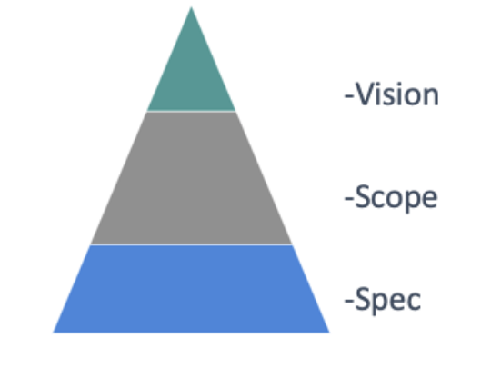

## Vision

# Purpose of the Vision

The purpose of this document is to set out the highest level of guidance for
Compose as an open source specification.
The objective is to inform contributor partners about the highest level goals
of Compose and what sorts of feature areas we believe would fit with the future
of Compose.

Guard rails and guidance need to be in place for three types of changes:
vision, scope and spec.
We expect frequent changes to the spec as users contribute, infrequent changes
to scope as we assess new features and very rare changes to the overall vision.

For contributors adding features or making more fundamental changes, this
document should act as guidance as to whether the Compose specification is the
right place for these.
It can also act as a guide to allow people to assess if this project is
something they wish to contribute towards and help maintainers with. The
document should also be seen as a high level source of the truth to reference
when something is out of scope.

# Background

Today among developers, Compose is a widely adopted format with over 650k
Compose files on Github (as of January 2020) and beloved by its users as a way
to define multi-container applications.
Finding a way to further enable the use of Compose with multiple vendors, such
as cloud providers, and giving interested vendors and our users a way to input
into the future of Compose would benefit the wider community of new and
existing users.
To achieve this, Docker separated the Compose format specification out of the
Docker code base as a standalone specification.

Compose is already adopted in the broader community as a good format for
declaring container applications. Notably AWS have adopted v2 of the format as
a way to define applications for their ECS platform and the Kompose project
converts Compose files to Kubernetes YAML.
Allowing them and others to contribute to the specification, thus giving them
ownership of it, will ensure more platforms support the Compose format and it
will mitigate platform provider risk for adopting the format.

# The Compose Vision

In a world of format sprawl, the Compose format will be the simplest cloud and
platform agnostic way of defining container based applications.
A developer should be able to develop and debug an application on their local
system before confidently deploying it to a production platform– cloud or
otherwise.
The format will be portable across container platforms by providing a high
level abstraction for how the containers are built, deployed, connected, and
configured.

All developer tools should reduce the number of boring, mundane and repetitive
tasks that developers have to do so they have more time to create.
Developers love Compose as it is the simplest way to ‘string containers
together’ to test a set of components together as an application and to see how
they function.
Our goal is for Compose to continue to provide the best controls for developer
container scripting and creation of logical applications.

We are not building a tool to compete with Helm Charts or Kube YAML, but a
specification format to embrace common patterns and a high level definition for
container-based applications.
Helm or other tools could then rely on this format to make their user
experiences simpler and portable, while still providing more advanced
capabilities for specific scenarios.
A set of libraries and a reference implementation will be provided in order to
enable tools to more easily be built on top of the specification, facilitate
easy experimentation, and provide of validation of implementations.

The format wants to be a living specification that evolves over time and
provides a way for tool builders to experiment with new ideas.

## In Scope

The purpose of this section is to set out the areas of functionality that
Compose is set to target.
The scope should be seen as a whitelist. It can be changed if all maintainers
of the project agree on the change.

There are four areas of the specification:
* Core: Concerned with the structure of the application
* Build: Concerned with how the application containers images are built
* Deploy: Concerned with the environment where the application is deployed
* Extension: Platform specific components and testing area
* Out: Scope areas Compose will specifically avoid or not look to address

**Name**|**Description**|**Area**|**Reason**
:-----|:-----|:-----|:-----
Service list|List of services that the developer wishes to deploy or work with|Core|Logical structure of the application
Internal connectivity |Which services can communicate with each other|Core|Logical structure of the application
External connectivity |Which application services are exposed and how|Core|Logical structure of the application
Volumes|How and where data is stored|Core|Logical structure of the application
Labelling|Make parts of application identifiable|Core|Ease of user/structure of application 
Container image build|Allow scripting of container image build|Build|Part of developer inner loop
Container runtime configuration|"Entrypoint, environment, healthchecks, etc."|Deploy|
Service configuration|Infrastructure specific configuration stored in the orchestrator|Deploy|
Service secrets|Infrastructure specific secrets stored in the orchestrator|Deploy|
Deployment strategy|How services are deployed (e.g.: placement, affinity, etc.)|Deploy|
Production runtime service parameters|Replicas, CPU/memory limits, etc.|Deploy|
Non-container workloads|Other Cloud native components |Extension|Not containers but stateless cloud native component
Logging|Where logs are kept|Out|Production Ops concern
Platform infrastructure|"Cluster setup, DBaaS, etc."|Out|Production Ops concern
