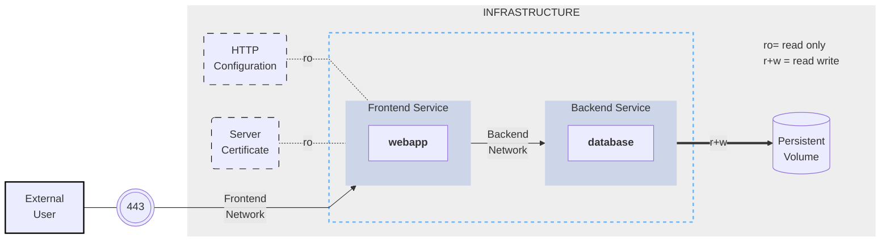

<!---
This file is generated, changes will be overwritten or CI specification check will fail
All changes should be done in the markdown files located in the spec directory
-->
# The Compose Specification
{:.no_toc}

* ToC
  {:toc}

# Status of this document

This document specifies the Compose file format used to define multi-containers applications. Distribution of this document is unlimited.

## Requirements and optional attributes

The Compose specification includes properties designed to target a local [OCI](https://opencontainers.org/) container runtime,
exposing Linux kernel specific configuration options, but also some Windows container specific properties. It is also designed for cloud platform features related to resource placement on a cluster, replicated application distribution, and scalability.

We acknowledge that no Compose implementation is expected to support all attributes, and that support for some properties
is platform dependent and can only be confirmed at runtime. The definition of a versioned schema to control the supported
properties in a Compose file, established by the [docker-compose](https://github.com/docker/compose) tool where the Compose
file format was designed, doesn't offer any guarantee to the end-user that attributes will be actually implemented.

The specification defines the expected configuration syntax and behavior. Unless noted, supporting any of these is optional.

A Compose implementation to parse a Compose file using unsupported attributes should warn users. We recommend the following implementors
to support those running modes:

* Default: warn the user about unsupported attributes, but ignore them
* Strict: warn the user about unsupported attributes and reject the Compose file
* Loose: ignore unsupported attributes AND unknown attributes (that were not defined by the spec by the time implementation was created)

From this point onwards, references made to 'Compose' can be interpreted as 'a Compose implementation'. 
# The Compose application model

The Compose Specification lets you define a platform-agnostic container based application. Such an application is designed as a set of containers which have to both run together with adequate shared resources and communication channels.

Computing components of an application are defined as [services](05-services.md). A service is an abstract concept implemented on platforms by running the same container image, and configuration, one or more times.

Services communicate with each other through [networks](06-networks.md). In the Compose Specification, a network is a platform capability abstraction to establish an IP route between containers within services connected together. Low-level, platform-specific networking options are grouped into the Network definition and may be partially implemented on some platforms.

Services store and share persistent data into [volumes](07-volumes.md). The Specification describes such a persistent data as a high-level filesystem mount with global options. Actual platform-specific implementation details are grouped into the volumes definition and may be partially implemented on some platforms.

Some services require configuration data that is dependent on the runtime or platform. For this, the Specification defines a dedicated [configs](08-configs.md) concept. From a service container point of view, configs are comparable to volumes, in that they are files mounted into the container. But the actual definition involves distinct platform resources and services, which are abstracted by this type.

A [secret](09-secrets.md) is a specific flavor of configuration data for sensitive data that should not be exposed without security considerations. Secrets are made available to services as files mounted into their containers, but the platform-specific resources to provide sensitive data are specific enough to deserve a distinct concept and definition within the Compose specification.

>**Note**
>
> With volumes, configs and secrets you can have a simple declaration at the top-level and then add more platform-specific information at the service level.

A project is an individual deployment of an application specification on a platform. A project's name, set with the top-level [`name`](04-version-and-name.md) attribute, is used to group
resources together and isolate them from other applications or other installation of the same Compose specified application with distinct parameters. If you are creating resources on a platform, you must prefix resource names by project and
set the label `com.docker.compose.project`.

Compose offers a way for users to set a custom project name and override this name, so that the same `compose.yaml` file can be deployed twice on the same infrastructure, without changes, by just passing a distinct name.

Project names must contain only lowercase letters, decimal digits, dashes, and underscores, and must begin with a lowercase letter or decimal digit.

## Illustrative example

The following example illustrates the Compose Specification concepts outlined above. The example is non-normative.

Consider an application split into a frontend web application and a backend service.

The frontend is configured at runtime with an HTTP configuration file managed by infrastructure, providing an external domain name, and an HTTPS server certificate injected by the platform's secured secret store.

The backend stores data in a persistent volume.

Both services communicate with each other on an isolated back-tier network, while the frontend is also connected to a front-tier network and exposes port 443 for external usage.



The example application is composed of the following parts:

- 2 services, backed by Docker images: `webapp` and `database`
- 1 secret (HTTPS certificate), injected into the frontend
- 1 configuration (HTTP), injected into the frontend
- 1 persistent volume, attached to the backend
- 2 networks

```yml
services:
  frontend:
    image: example/webapp
    ports:
      - "443:8043"
    networks:
      - front-tier
      - back-tier
    configs:
      - httpd-config
    secrets:
      - server-certificate

  backend:
    image: example/database
    volumes:
      - db-data:/etc/data
    networks:
      - back-tier

volumes:
  db-data:
    driver: flocker
    driver_opts:
      size: "10GiB"

configs:
  httpd-config:
    external: true

secrets:
  server-certificate:
    external: true

networks:
  # The presence of these objects is sufficient to define them
  front-tier: {}
  back-tier: {}
```

This example illustrates the distinction between volumes, configs and secrets. While all of them are all exposed
to service containers as mounted files or directories, only a volume can be configured for read+write access.
Secrets and configs are read-only. The volume configuration allows you to select a volume driver and pass driver options
to tweak volume management according to the actual infrastructure. Configs and secrets rely on platform services,
and are declared `external` as they are not managed as part of the application lifecycle. Compose uses a platform-specific lookup mechanism to retrieve runtime values.
# Compose file

The Compose file is a [YAML](http://yaml.org/) file defining:
- [Version](04-version-and-name.md) (Optional)
- [Services](05-services.md) (Required)
- [Networks](06-networks.md)
- [Volumes](07-volumes.md)
- [Configs](08-configs.md) 
- [Secrets](09-secrets.md)

The default path for a Compose file is `compose.yaml` (preferred) or `compose.yml` that is placed in the working directory.
Compose also supports `docker-compose.yaml` and `docker-compose.yml` for backwards compatibility of earlier versions.
If both files exist, Compose prefers the canonical `compose.yaml`.

You can use [fragments](10-fragments.md) and [extensions](11-extension.md) to keep your Compose file efficient and easy to maintain.

Multiple Compose files can be [merged](13-merge.md) together to define the application model. The combination of YAML files are implemented by appending or overriding YAML elements based on the Compose file order you set. 
Simple attributes and maps get overridden by the highest order Compose file, lists get merged by appending. Relative
paths are resolved based on the first Compose file's parent folder, whenever complimentary files being
merged are hosted in other folders. As some Compose file elements can both be expressed as single strings or complex objects, merges apply to
the expanded form.

If you want to reuse other Compose files, or factor out parts of you application model into separate Compose files, you can also use [`include`](14-include.md). This is useful if your Compose application is dependent on another application which is managed by a different team, or needs to be shared with others.
# Version and name top-level elements

## Version top-level element (obsolete)

The top-level `version` property is defined by the Compose Specification for backward compatibility. It is only informative you'll receive a warning message that it is obsolete if used. 

Compose doesn't use `version` to select an exact schema to validate the Compose file, but
prefers the most recent schema when it's implemented.

Compose validates whether it can fully parse the Compose file. If some fields are unknown, typically
because the Compose file was written with fields defined by a newer version of the Specification, you'll receive a warning message. Compose offers options to ignore unknown fields (as defined by ["loose"](01-status.md#requirements-and-optional-attributes) mode).

## Name top-level element

The top-level `name` property is defined by the Specification as the project name to be used if you don't set one explicitly.
Compose offers a way for you to override this name, and sets a
default project name to be used if the top-level `name` element is not set.

Whenever a project name is defined by top-level `name` or by some custom mechanism, it is exposed for
[interpolation](12-interpolation.md) and environment variable resolution as `COMPOSE_PROJECT_NAME`

```yml
services:
  foo:
    image: busybox
    environment:
      - COMPOSE_PROJECT_NAME
    command: echo "I'm running ${COMPOSE_PROJECT_NAME}"
```
# Services top-level element

A service is an abstract definition of a computing resource within an application which can be scaled or replaced
independently from other components. Services are backed by a set of containers, run by the platform
according to replication requirements and placement constraints. As services are backed by containers, they are defined
by a Docker image and set of runtime arguments. All containers within a service are identically created with these
arguments.

A Compose file must declare a `services` top-level element as a map whose keys are string representations of service names,
and whose values are service definitions. A service  definition contains the configuration that is applied to each
service container.

Each service may also include a `build` section, which defines how to create the Docker image for the service.
Compose supports building docker images using this service definition. If not used, the `build` section is ignored and the Compose file is still considered valid. Build support is an optional aspect of the Compose Specification, and is
described in detail in the [Compose Build Specification](build.md) documentation.

Each service defines runtime constraints and requirements to run its containers. The `deploy` section groups
these constraints and allows the platform to adjust the deployment strategy to best match containers' needs with
available resources. Deploy support is an optional aspect of the Compose Specification, and is
described in detail in the [Compose Deploy Specification](deploy.md) documentation.
If not implemented the `deploy` section is ignored and the Compose file is still considered valid.

## attach

[](https://github.com/docker/compose/releases/v2.20.0)

When `attach` is defined and set to `false` Compose does not collect service logs,
until you explicitly request it to.

The default service configuration is `attach: true`.

## build

`build` specifies the build configuration for creating a container image from source, as defined in the [Compose Build Specification](build.md).

## blkio_config

`blkio_config` defines a set of configuration options to set block IO limits for a service.

```yml
services:
  foo:
    image: busybox
    blkio_config:
       weight: 300
       weight_device:
         - path: /dev/sda
           weight: 400
       device_read_bps:
         - path: /dev/sdb
           rate: '12mb'
       device_read_iops:
         - path: /dev/sdb
           rate: 120
       device_write_bps:
         - path: /dev/sdb
           rate: '1024k'
       device_write_iops:
         - path: /dev/sdb
           rate: 30
```

### device_read_bps, device_write_bps

Set a limit in bytes per second for read / write operations on a given device.
Each item in the list must have two keys:

- `path`: Defines the symbolic path to the affected device.
- `rate`: Either as an integer value representing the number of bytes or as a string expressing a byte value.

### device_read_iops, device_write_iops

Set a limit in operations per second for read / write operations on a given device.
Each item in the list must have two keys:

- `path`: Defines the symbolic path to the affected device.
- `rate`: As an integer value representing the permitted number of operations per second.

### weight

Modify the proportion of bandwidth allocated to a service relative to other services.
Takes an integer value between 10 and 1000, with 500 being the default.

### weight_device

Fine-tune bandwidth allocation by device. Each item in the list must have two keys:

- `path`: Defines the symbolic path to the affected device.
- `weight`: An integer value between 10 and 1000.

## cpu_count

`cpu_count` defines the number of usable CPUs for service container.

## cpu_percent

`cpu_percent` defines the usable percentage of the available CPUs.

## cpu_shares

`cpu_shares` defines, as integer value, a service container's relative CPU weight versus other containers.

## cpu_period

`cpu_period` configures CPU CFS (Completely Fair Scheduler) period when a platform is based
on Linux kernel.

## cpu_quota

`cpu_quota` configures CPU CFS (Completely Fair Scheduler) quota when a platform is based
on Linux kernel.

## cpu_rt_runtime

`cpu_rt_runtime` configures CPU allocation parameters for platforms with support for realtime scheduler. It can be either
an integer value using microseconds as unit or a [duration](11-extension.md#specifying-durations).

```yml
 cpu_rt_runtime: '400ms'
 cpu_rt_runtime: 95000`
```

## cpu_rt_period

`cpu_rt_period` configures CPU allocation parameters for platforms with support for realtime scheduler. It can be either
an integer value using microseconds as unit or a [duration](11-extension.md#specifying-durations).

```yml
 cpu_rt_period: '1400us'
 cpu_rt_period: 11000`
```

## cpus

`cpus` define the number of (potentially virtual) CPUs to allocate to service containers. This is a fractional number.
`0.000` means no limit.

When both are set, `cpus` must be consistent with the `cpus` attribute in the
[Deploy Specification](deploy.md#cpus)

## cpuset

`cpuset` defines the explicit CPUs in which to allow execution. Can be a range `0-3` or a list `0,1`

## cap_add

`cap_add` specifies additional container [capabilities](https://man7.org/linux/man-pages/man7/capabilities.7.html)
as strings.

```yaml
cap_add:
  - ALL
```

## cap_drop

`cap_drop` specifies container [capabilities](https://man7.org/linux/man-pages/man7/capabilities.7.html) to drop
as strings.

```yaml
cap_drop:
  - NET_ADMIN
  - SYS_ADMIN
```

## cgroup

[](https://github.com/docker/compose/releases/v2.15.0)


`cgroup` specifies the cgroup namespace to join. When unset, it is the container runtime's decision to
select which cgroup namespace to use, if supported.

- `host`: Runs the container in the Container runtime cgroup namespace.
- `private`: Runs the container in its own private cgroup namespace.

## cgroup_parent

`cgroup_parent` specifies an optional parent [cgroup](https://man7.org/linux/man-pages/man7/cgroups.7.html) for the container.

```yaml
cgroup_parent: m-executor-abcd
```

## command

`command` overrides the default command declared by the container image, for example by Dockerfile's `CMD`.

```yaml
command: bundle exec thin -p 3000
```

The value can also be a list, in a manner similar to [Dockerfile](https://docs.docker.com/engine/reference/builder/#cmd):

```yaml
command: [ "bundle", "exec", "thin", "-p", "3000" ]
```

If the value is `null`, the default command from the image is used.

If the value is `[]` (empty list) or `''` (empty string), the default command declared by the image is ignored,
i.e. overridden to be empty.

## configs

Configs allow services to adapt their behaviour without the need to rebuild a Docker image. 
Services can only access configs when explicitly granted by the `configs` attribute. Two different syntax variants are supported.

Compose reports an error if `config` doesn't exist on the platform or isn't defined in the
[`configs` top-level element](08-configs.md) in the Compose file.

There are two syntaxes defined for configs. To remain compliant to this specification, an implementation
must support both syntaxes. Implementations must allow use of both short and long syntaxes within the same document.

You can grant a service access to multiple configs, and you can mix long and short syntax.

### Short syntax

The short syntax variant only specifies the config name. This grants the
container access to the config and mounts it as files into a service’s container’s filesystem. The location of the mount point within the container defaults to `/<config_name>` in Linux containers, and `C:\<config-name>` in Windows containers. 

The following example uses the short syntax to grant the `redis` service
access to the `my_config` and `my_other_config` configs. The value of
`my_config` is set to the contents of the file `./my_config.txt`, and
`my_other_config` is defined as an external resource, which means that it has
already been defined in the platform. If the external config does not exist,
the deployment fails.

```yml
services:
  redis:
    image: redis:latest
    configs:
      - my_config
      - my_other_config
configs:
  my_config:
    file: ./my_config.txt
  my_other_config:
    external: true
```

### Long syntax

The long syntax provides more granularity in how the config is created within the service's task containers.

- `source`: The name of the config as it exists in the platform.
- `target`: The path and name of the file to be mounted in the service's
  task containers. Defaults to `/<source>` if not specified.
- `uid` and `gid`: The numeric UID or GID that owns the mounted config file
  within the service's task containers. Default value when not specified is USER running container.
- `mode`: The [permissions](https://wintelguy.com/permissions-calc.pl) for the file that is mounted within the service's
  task containers, in octal notation. Default value is world-readable (`0444`).
  Writable bit must be ignored. The executable bit can be set.

The following example sets the name of `my_config` to `redis_config` within the
container, sets the mode to `0440` (group-readable) and sets the user and group
to `103`. The `redis` service does not have access to the `my_other_config`
config.

```yml
services:
  redis:
    image: redis:latest
    configs:
      - source: my_config
        target: /redis_config
        uid: "103"
        gid: "103"
        mode: 0440
configs:
  my_config:
    external: true
  my_other_config:
    external: true
```

## container_name

`container_name` is a string that specifies a custom container name, rather than a name generated by default.

```yml
container_name: my-web-container
```

Compose does not scale a service beyond one container if the Compose file specifies a
`container_name`. Attempting to do so results in an error.

`container_name` follows the regex format of `[a-zA-Z0-9][a-zA-Z0-9_.-]+`

## credential_spec

`credential_spec` configures the credential spec for a managed service account.

If you have services that use Windows containers, you can use `file:` and
`registry:` protocols for `credential_spec`. Compose also supports additional
protocols for custom use-cases.

The `credential_spec` must be in the format `file://<filename>` or `registry://<value-name>`.

```yml
credential_spec:
  file: my-credential-spec.json
```

When using `registry:`, the credential spec is read from the Windows registry on
the daemon's host. A registry value with the given name must be located in:

    HKLM\SOFTWARE\Microsoft\Windows NT\CurrentVersion\Virtualization\Containers\CredentialSpecs

The following example loads the credential spec from a value named `my-credential-spec`
in the registry:

```yml
credential_spec:
  registry: my-credential-spec
```

### Example gMSA configuration

When configuring a gMSA credential spec for a service, you only need
to specify a credential spec with `config`, as shown in the following example:

```yml
services:
  myservice:
    image: myimage:latest
    credential_spec:
      config: my_credential_spec

configs:
  my_credentials_spec:
    file: ./my-credential-spec.json|
```

## depends_on

`depends_on` expresses startup and shutdown dependencies between services.

### Short syntax

The short syntax variant only specifies service names of the dependencies.
Service dependencies cause the following behaviors:

- Compose creates services in dependency order. In the following
  example, `db` and `redis` are created before `web`.

- Compose removes services in dependency order. In the following
  example, `web` is removed before `db` and `redis`.

Simple example:

```yml
services:
  web:
    build: .
    depends_on:
      - db
      - redis
  redis:
    image: redis
  db:
    image: postgres
```

Compose guarantees dependency services have been started before
starting a dependent service.
Compose waits for dependency services to be "ready" before
starting a dependent service.

### Long syntax

The long form syntax enables the configuration of additional fields that can't be
expressed in the short form.

- `restart`: When set to `true` Compose restarts this service after it updates the dependency service.
  This applies to an explicit restart controlled by a Compose operation, and excludes automated restart by the container runtime
  after the container dies. [](https://github.com/docker/compose/releases/v2.17.0)


- `condition`: Sets the condition under which dependency is considered satisfied
  - `service_started`: An equivalent of the short syntax described above
  - `service_healthy`: Specifies that a dependency is expected to be "healthy"
    (as indicated by [healthcheck](#healthcheck)) before starting a dependent
    service.
  - `service_completed_successfully`: Specifies that a dependency is expected to run
    to successful completion before starting a dependent service.
- `required`: When set to `false` Compose only warns you when the dependency service isn't started or available. If it's not defined
    the default value of `required` is `true`. [](https://github.com/docker/compose/releases/v2.20.0)


Service dependencies cause the following behaviors:

- Compose creates services in dependency order. In the following
  example, `db` and `redis` are created before `web`.

- Compose waits for healthchecks to pass on dependencies
  marked with `service_healthy`. In the following example, `db` is expected to
  be "healthy" before `web` is created.

- Compose removes services in dependency order. In the following
  example, `web` is removed before `db` and `redis`.

```yml
services:
  web:
    build: .
    depends_on:
      db:
        condition: service_healthy
        restart: true
      redis:
        condition: service_started
  redis:
    image: redis
  db:
    image: postgres
```

Compose guarantees dependency services are started before
starting a dependent service.
Compose guarantees dependency services marked with
`service_healthy` are "healthy" before starting a dependent service.

## deploy

`deploy` specifies the configuration for the deployment and lifecycle of services, as defined [in the Compose Deploy Specification](deploy.md).

## develop

[](https://github.com/docker/compose/releases/v2.22.0)


`develop` specifies the development configuration for maintaining a container in sync with source, as defined in the [Development Section](develop.md).

## device_cgroup_rules

`device_cgroup_rules` defines a list of device cgroup rules for this container.
The format is the same format the Linux kernel specifies in the [Control Groups
Device Whitelist Controller](https://www.kernel.org/doc/html/latest/admin-guide/cgroup-v1/devices.html).

```yml
device_cgroup_rules:
  - 'c 1:3 mr'
  - 'a 7:* rmw'
```

## devices

`devices` defines a list of device mappings for created containers in the form of
`HOST_PATH:CONTAINER_PATH[:CGROUP_PERMISSIONS]`.

```yml
devices:
  - "/dev/ttyUSB0:/dev/ttyUSB0"
  - "/dev/sda:/dev/xvda:rwm"
```

## dns

`dns` defines custom DNS servers to set on the container network interface configuration. It can be a single value or a list.

```yml
dns: 8.8.8.8
```

```yml
dns:
  - 8.8.8.8
  - 9.9.9.9
```

## dns_opt

`dns_opt` list custom DNS options to be passed to the container’s DNS resolver (`/etc/resolv.conf` file on Linux).

```yml
dns_opt:
  - use-vc
  - no-tld-query
```

## dns_search

`dns_search` defines custom DNS search domains to set on container network interface configuration. It can be a single value or a list.

```yml
dns_search: example.com
```

```yml
dns_search:
  - dc1.example.com
  - dc2.example.com
```

## domainname

`domainname` declares a custom domain name to use for the service container. It must be a valid RFC 1123 hostname.

## entrypoint

`entrypoint` declares the default entrypoint for the service container.
This overrides the `ENTRYPOINT` instruction from the service's Dockerfile.

If `entrypoint` is non-null, Compose ignores any default command from the image, for example the `CMD`
instruction in the Dockerfile.

See also [`command`](#command) to set or override the default command to be executed by the entrypoint process.

In its short form, the value can be defined as a string:
```yml
entrypoint: /code/entrypoint.sh
```

Alternatively, the value can also be a list, in a manner similar to the
[Dockerfile](https://docs.docker.com/engine/reference/builder/#cmd):

```yml
entrypoint:
  - php
  - -d
  - zend_extension=/usr/local/lib/php/extensions/no-debug-non-zts-20100525/xdebug.so
  - -d
  - memory_limit=-1
  - vendor/bin/phpunit
```

If the value is `null`, the default entrypoint from the image is used.

If the value is `[]` (empty list) or `''` (empty string), the default entrypoint declared by the image is ignored,
i.e. overridden to be empty.

## env_file

`env_file` adds environment variables to the container based on the file content.

```yml
env_file: .env
```

`env_file` can also be a list. The files in the list are processed from the top down. For the same variable
specified in two env files, the value from the last file in the list stands.

```yml
env_file:
  - ./a.env
  - ./b.env
```

Relative path are resolved from the Compose file's parent folder. As absolute paths prevent the Compose
file from being portable, Compose warns you when such a path is used to set `env_file`.

Environment variables declared in the [environment](#environment) section override these values. This holds true even if those values are
empty or undefined.

List elements can also be declared as a mapping, which then lets you set an additional
attributes

### required

`required` attribute defaults to `true`. When `required` is set to `false` and the `.env` file is missing,
Compose silently ignores the entry.

```yml
env_file:
  - path: ./default.env
    required: true # default
  - path: ./override.env
    required: false
```

### format

`format` attribute lets you to use an alternative file formats for `env_file`. When not set, `env_file` is parsed according to 
Compose rules as described in next section.

`raw` format lets you use an `env_file` with key=value items, but without any attempt from Compose to parse the value for interpolation. 
This let you pass values as-is including quotes and `$` signs.

```yml
env_file:
  - path: ./default.env
    format: raw
```


### Env_file format

Each line in an `.env` file must be in `VAR[=[VAL]]` format. The following syntax rules apply:

- Lines beginning with `#` are processed as comments and ignored.
- Blank lines are ignored.
- Unquoted and double-quoted (`"`) values have [Interpolation](12-interpolation.md) applied.
- Each line represents a key-value pair. Values can optionally be quoted.
  - `VAR=VAL` -> `VAL`
  - `VAR="VAL"` -> `VAL`
  - `VAR='VAL'` -> `VAL`
- Inline comments for unquoted values must be preceded with a space.
  - `VAR=VAL # comment` -> `VAL`
  - `VAR=VAL# not a comment` -> `VAL# not a comment`
- Inline comments for quoted values must follow the closing quote.
  - `VAR="VAL # not a comment"` -> `VAL # not a comment`
  - `VAR="VAL" # comment` -> `VAL`
- Single-quoted (`'`) values are used literally.
  - `VAR='$OTHER'` -> `$OTHER`
  - `VAR='${OTHER}'` -> `${OTHER}`
- Quotes can be escaped with `\`.
  - `VAR='Let\'s go!'` -> `Let's go!`
  - `VAR="{\"hello\": \"json\"}"` -> `{"hello": "json"}`
- Common shell escape sequences including `\n`, `\r`, `\t`, and `\\` are supported in double-quoted values.
  - `VAR="some\tvalue"` -> `some  value`
  - `VAR='some\tvalue'` -> `some\tvalue`
  - `VAR=some\tvalue` -> `some\tvalue`

`VAL` may be omitted, in such cases the variable value is an empty string.
`=VAL` may be omitted, in such cases the variable is unset.

```bash
# Set Rails/Rack environment
RACK_ENV=development
VAR="quoted"
```

## environment

`environment` defines environment variables set in the container. `environment` can use either an array or a
map. Any boolean values; true, false, yes, no, should be enclosed in quotes to ensure
they are not converted to True or False by the YAML parser.

Environment variables can be declared by a single key (no value to equals sign). In this case Compose
relies on you to resolve the value. If the value is not resolved, the variable
is unset and is removed from the service container environment.

Map syntax:

```yml
environment:
  RACK_ENV: development
  SHOW: "true"
  USER_INPUT:
```

Array syntax:

```yml
environment:
  - RACK_ENV=development
  - SHOW=true
  - USER_INPUT
```

When both `env_file` and `environment` are set for a service, values set by `environment` have precedence.

## expose

`expose` defines the (incoming) port or a range of ports that Compose exposes from the container. These ports must be
accessible to linked services and should not be published to the host machine. Only the internal container
ports can be specified.

Syntax is `<portnum>/[<proto>]` or `<startport-endport>/[<proto>]` for a port range.
When not explicitly set, `tcp` protocol is used.

```yml
expose:
  - "3000"
  - "8000"
  - "8080-8085/tcp"
```

> **Note**
>
> If the Dockerfile for the image already exposes ports, it is visible to other containers on the network even if `expose` is not set in your Compose file. 

## extends

`extends` lets you share common configurations among different files, or even different projects entirely. With `extends` you can define a common set of service options in one place and refer to it from anywhere. You can refer to another Compose file and select a service you want to also use in your own application, with the ability to override some attributes for your own needs.

You can use `extends` on any service together with other configuration keys. The `extends` value must be a mapping
defined with a required `service` and an optional `file` key.

```yaml
extends:
  file: common.yml
  service: webapp
```

- `service`: Defines the name of the service being referenced as a base, for example `web` or `database`.
- `file`: The location of a Compose configuration file defining that service.

### Restrictions

When a service is referenced using `extends`, it can declare dependencies on other resources. These dependencies 
may be explicitly defined through attributes like `volumes`, `networks`, `configs`, `secrets`, `links`, `volumes_from`,
or `depends_on`. Alternatively, dependencies can reference another service using the `service:{name}` syntax in 
namespace declarations such as `ipc`, `pid`, or `network_mode`.

Compose does not automatically import these referenced resources into the extended model. It is the responsibility 
of the Compose file author to ensure all required resources are explicitly declared in the model that relies on `extends`.

Circular references with `extends` are not supported, Compose returns an error when one is detected.

### Finding referenced service

`file` value can be:

- Not present.
  This indicates that another service within the same Compose file is being referenced.
- File path, which can be either:
  - Relative path. This path is considered as relative to the location of the main Compose
    file.
  - Absolute path.

A service denoted by `service` must be present in the identified referenced Compose file.
Compose returns an error if:

- The service denoted by `service` is not found.
- The Compose file denoted by `file` is not found.

### Merging service definitions

Two service definitions, the main one in the current Compose file and the referenced one
specified by `extends`, are merged in the following way:

- Mappings: Keys in mappings of the main service definition override keys in mappings
  of the referenced service definition. Keys that aren't overridden are included as is.
- Sequences: Items are combined together into a new sequence. The order of elements is
  preserved with the referenced items coming first and main items after.
- Scalars: Keys in the main service definition take precedence over keys in the
  referenced one.

#### Mappings

The following keys should be treated as mappings: `annotations`, `build.args`, `build.labels`,
`build.extra_hosts`, `deploy.labels`, `deploy.update_config`, `deploy.rollback_config`,
`deploy.restart_policy`, `deploy.resources.limits`, `environment`, `healthcheck`,
`labels`, `logging.options`, `sysctls`, `storage_opt`, `extra_hosts`, `ulimits`.

One exception that applies to `healthcheck` is that the main mapping cannot specify
`disable: true` unless the  referenced mapping also specifies `disable: true`. Compose returns an error in this case.

For example, the input below:

```yaml
services:
  common:
    image: busybox
    environment:
      TZ: utc
      PORT: 80
  cli:
    extends:
      service: common
    environment:
      PORT: 8080
```

Produces the following configuration for the `cli` service. The same output is
produced if array syntax is used.

```yaml
environment:
  PORT: 8080
  TZ: utc
image: busybox
```

Items under `blkio_config.device_read_bps`, `blkio_config.device_read_iops`,
`blkio_config.device_write_bps`, `blkio_config.device_write_iops`, `devices` and
`volumes` are also treated as mappings where key is the target path inside the
container.

For example, the input below:

```yaml
services:
  common:
    image: busybox
    volumes:
      - common-volume:/var/lib/backup/data:rw
  cli:
    extends:
      service: common
    volumes:
      - cli-volume:/var/lib/backup/data:ro
```

Produces the following configuration for the `cli` service. Note that the mounted path
now points to the new volume name and `ro` flag was applied.

```yaml
image: busybox
volumes:
- cli-volume:/var/lib/backup/data:ro
```

If the referenced service definition contains `extends` mapping, the items under it
are simply copied into the new merged definition. The merging process is then kicked
off again until no `extends` keys are remaining.

For example, the input below:

```yaml
services:
  base:
    image: busybox
    user: root
  common:
    image: busybox
    extends:
      service: base
  cli:
    extends:
      service: common
```

Produces the following configuration for the `cli` service. Here, `cli` services
gets `user` key from `common` service, which in turn gets this key from `base`
service.

```yaml
image: busybox
user: root
```

#### Sequences

The following keys should be treated as sequences: `cap_add`, `cap_drop`, `configs`,
`deploy.placement.constraints`, `deploy.placement.preferences`,
`deploy.reservations.generic_resources`, `device_cgroup_rules`, `expose`,
`external_links`, `ports`, `secrets`, `security_opt`.
Any duplicates resulting from the merge are removed so that the sequence only
contains unique elements.

For example, the input below:

```yaml
services:
  common:
    image: busybox
    security_opt:
      - label:role:ROLE
  cli:
    extends:
      service: common
    security_opt:
      - label:user:USER
```

Produces the following configuration for the `cli` service.

```yaml
image: busybox
security_opt:
- label:role:ROLE
- label:user:USER
```

In case list syntax is used, the following keys should also be treated as sequences:
`dns`, `dns_search`, `env_file`, `tmpfs`. Unlike sequence fields mentioned above,
duplicates resulting from the merge are not removed.

#### Scalars

Any other allowed keys in the service definition should be treated as scalars.

## annotations

`annotations` defines annotations for the container. `annotations` can use either an array or a map.

```yml
annotations:
  com.example.foo: bar
```

```yml
annotations:
  - com.example.foo=bar
```

## external_links

`external_links` link service containers to services managed outside of your Compose application.
`external_links` define the name of an existing service to retrieve using the platform lookup mechanism.
An alias of the form `SERVICE:ALIAS` can be specified.

```yml
external_links:
  - redis
  - database:mysql
  - database:postgresql
```

## extra_hosts

`extra_hosts` adds hostname mappings to the container network interface configuration (`/etc/hosts` for Linux).

### Short syntax
Short syntax uses plain strings in a list. Values must set hostname and IP address for additional hosts in the form of `HOSTNAME=IP`.

```yml
extra_hosts:
  - "somehost=162.242.195.82"
  - "otherhost=50.31.209.229"
  - "myhostv6=::1"
```

IPv6 addresses can be enclosed in square brackets, for example:

```yml
extra_hosts:
  - "myhostv6=[::1]"
```

The separator `=` is preferred [](https://github.com/docker/compose/releases/v2.24.1)
 but `:` can also be used. For example:

```yml
extra_hosts:
  - "somehost:162.242.195.82"
  - "myhostv6:::1"
```

### Long syntax
Alternatively, `extra_hosts` can be set as a mapping between hostname(s) and IP(s)

```yml
extra_hosts:
  somehost: "162.242.195.82"
  otherhost: "50.31.209.229"
  myhostv6: "::1"
```

Compose creates a matching entry with the IP address and hostname in the container's network
configuration, which means for Linux `/etc/hosts` get extra lines:

```
162.242.195.82  somehost
50.31.209.229   otherhost
::1             myhostv6
```

## gpus

[](https://github.com/docker/compose/releases/NEXT)

`gpus` specifies GPU devices to be allocated for container usage. This is equivalent to a [device request](deploy.md#devices) with
an implicit `gpu` capability.

```yaml
services:
  model:
    gpus: 
      - driver: 3dfx
        count: 2
```

`gpus` also can ge set as string `all` to allocate all aviable GPU devices to container.

```yaml
services:
  model:
    gpus: all
```

## group_add

`group_add` specifies additional groups, by name or number, which the user inside the container must be a member of.

An example of where this is useful is when multiple containers (running as different users) need to all read or write
the same file on a shared volume. That file can be owned by a group shared by all the containers, and specified in
`group_add`.

```yml
services:
  myservice:
    image: alpine
    group_add:
      - mail
```

Running `id` inside the created container must show that the user belongs to the `mail` group, which would not have
been the case if `group_add` were not declared.

## healthcheck

`healthcheck` declares a check that's run to determine whether or not the service containers are "healthy". It works in the same way, and has the same default values, as the
[HEALTHCHECK Dockerfile instruction](https://docs.docker.com/engine/reference/builder/#healthcheck)
set by the service's Docker image. Your Compose file can override the values set in the Dockerfile. 

```yml
healthcheck:
  test: ["CMD", "curl", "-f", "http://localhost"]
  interval: 1m30s
  timeout: 10s
  retries: 3
  start_period: 40s
  start_interval: 5s
```

`interval`, `timeout`, `start_period`, and `start_interval` [](https://github.com/docker/compose/releases/v2.20.2) are [specified as durations](11-extension.md#specifying-durations).

`test` defines the command Compose runs to check container health. It can be
either a string or a list. If it's a list, the first item must be either `NONE`, `CMD` or `CMD-SHELL`.
If it's a string, it's equivalent to specifying `CMD-SHELL` followed by that string.

```yml
# Hit the local web app
test: ["CMD", "curl", "-f", "http://localhost"]
```

Using `CMD-SHELL` runs the command configured as a string using the container's default shell
(`/bin/sh` for Linux). Both forms below are equivalent:

```yml
test: ["CMD-SHELL", "curl -f http://localhost || exit 1"]
```

```yml
test: curl -f https://localhost || exit 1
```

`NONE` disables the healthcheck, and is mostly useful to disable the Healthcheck Dockerfile instruction set by the service's Docker image. Alternatively,
the healthcheck set by the image can be disabled by setting `disable: true`:

```yml
healthcheck:
  disable: true
```

## hostname

`hostname` declares a custom host name to use for the service container. It must be a valid RFC 1123 hostname.

## image

`image` specifies the image to start the container from. `image` must follow the Open Container Specification
[addressable image format](https://github.com/opencontainers/org/blob/master/docs/docs/introduction/digests.md),
as `[<registry>/][<project>/]<image>[:<tag>|@<digest>]`.

```yml
    image: redis
    image: redis:5
    image: redis@sha256:0ed5d5928d4737458944eb604cc8509e245c3e19d02ad83935398bc4b991aac7
    image: library/redis
    image: docker.io/library/redis
    image: my_private.registry:5000/redis
```

If the image does not exist on the platform, Compose attempts to pull it based on the `pull_policy`.
If you are also using the [Compose Build Specification](build.md), there are alternative options for controlling the precedence of
pull over building the image from source, however pulling the image is the default behavior.

`image` may be omitted from a Compose file as long as a `build` section is declared. If you are not using the Compose Build Specification, Compose won't work if `image` is missing from the Compose file.

## init

`init` runs an init process (PID 1) inside the container that forwards signals and reaps processes.
Set this option to `true` to enable this feature for the service.

```yml
services:
  web:
    image: alpine:latest
    init: true
```

The init binary that is used is platform specific.

## ipc

`ipc` configures the IPC isolation mode set by the service container. Available
values are platform specific, but Compose defines specific values
which must be implemented as described if supported:

- `shareable`: Gives the container its own private IPC namespace, with a
  possibility to share it with other containers.
- `service:{name}`: Makes the container join another container's
  (`shareable`) IPC namespace.

```yml
    ipc: "shareable"
    ipc: "service:[service name]"
```

## uts

[](https://github.com/docker/compose/releases/v2.15.1)


`uts` configures the UTS namespace mode set for the service container. When unspecified
it is the runtime's decision to assign a UTS namespace, if supported. Available values are:

- `'host'`: Results in the container using the same UTS namespace as the host.

```yml
    uts: "host"
```

## isolation

`isolation` specifies a container’s isolation technology. Supported values are platform specific.

## labels

`labels` add metadata to containers. You can use either an array or a map.

It's recommended that you use reverse-DNS notation to prevent your labels from conflicting with
those used by other software.

```yml
labels:
  com.example.description: "Accounting webapp"
  com.example.department: "Finance"
  com.example.label-with-empty-value: ""
```

```yml
labels:
  - "com.example.description=Accounting webapp"
  - "com.example.department=Finance"
  - "com.example.label-with-empty-value"
```

Compose creates containers with canonical labels:

- `com.docker.compose.project` set on all resources created by Compose to the user project name
- `com.docker.compose.service` set on service containers with service name as defined in the Compose file

The `com.docker.compose` label prefix is reserved. Specifying labels with this prefix in the Compose file
results in a runtime error.

## label_file

[](https://github.com/docker/compose/releases/NEXT)

`label_file` can be used to load multiple labels from a file. The file uses a key-value frmat, comparable
to `env_file`. 

You can specify multiple files as a List. The files in the list are processed in top-down order. If the same 
label is defined in multiple files, the value from the last file in the list overrides earlier ones.

```yaml
services:
  one:
    label_file: ./app.labels

  two:
    label_file: 
      - ./app.labels
      - ./additional.labels
```

## links

> **Note**
>
> Availability of the `links` attribute is implementation specific.

`links` defines a network link to containers in another service. Either specify both the service name and
a link alias (`SERVICE:ALIAS`), or just the service name.

```yml
web:
  links:
    - db
    - db:database
    - redis
```

Containers for the linked service are reachable at a hostname identical to the alias, or the service name
if no alias is specified.

Links are not required to enable services to communicate. When no specific network configuration is set,
any service is able to reach any other service at that service’s name on the `default` network. If services
do declare networks they are attached to, `links` does not override the network configuration and services not
attached to a shared network are not be able to communicate. Compose doesn't warn you about a configuration mismatch.

Links also express implicit dependency between services in the same way as
[depends_on](#depends_on), so they determine the order of service startup.

## logging

`logging` defines the logging configuration for the service.

```yml
logging:
  driver: syslog
  options:
    syslog-address: "tcp://192.168.0.42:123"
```

The `driver` name specifies a logging driver for the service's containers. The default and available values
are platform specific. Driver specific options can be set with `options` as key-value pairs.

## network_mode

`network_mode` sets a service container's network mode. Available values are platform specific, but Compose defines specific values which must be implemented as described if supported:

- `none`: Turns off all container networking.
- `host`: Gives the container raw access to the host's network interface.
- `service:{name}`: Gives the service container access to the specified service only.
- `container:{name}`: Gives the service container access to the specified container ().

```yml
    network_mode: "host"
    network_mode: "none"
    network_mode: "service:[service name]"
```

When set, the [`networks`](#networks) attribute is not allowed and Compose rejects any
Compose file containing both attributes.

## networks

`networks` defines the networks that service containers are attached to, referencing entries under the
[top-level `networks` key](06-networks.md).

```yml
services:
  some-service:
    networks:
      - some-network
      - other-network
```

### aliases

`aliases` declares alternative hostnames for the service on the network. Other containers on the same
network can use either the service name or an alias to connect to one of the service's containers.

Since `aliases` are network-scoped, the same service can have different aliases on different networks.

> **Note**
> A network-wide alias can be shared by multiple containers, and even by multiple services.
> If it is, then exactly which container the name resolves to is not guaranteed.

```yml
services:
  some-service:
    networks:
      some-network:
        aliases:
          - alias1
          - alias3
      other-network:
        aliases:
          - alias2
```

In the following example, service `frontend` is able to reach the `backend` service at
the hostname `backend` or `database` on the `back-tier` network. The service `monitoring`
is able to reach same `backend` service at `backend` or `mysql` on the `admin` network.

```yml
services:
  frontend:
    image: example/webapp
    networks:
      - front-tier
      - back-tier

  monitoring:
    image: example/monitoring
    networks:
      - admin

  backend:
    image: example/backend
    networks:
      back-tier:
        aliases:
          - database
      admin:
        aliases:
          - mysql

networks:
  front-tier:
  back-tier:
  admin:
```

### ipv4_address, ipv6_address

Specify a static IP address for a service container when joining the network.

The corresponding network configuration in the [top-level networks section](06-networks.md) must have an
`ipam` attribute with subnet configurations covering each static address.

```yml
services:
  frontend:
    image: example/webapp
    networks:
      front-tier:
        ipv4_address: 172.16.238.10
        ipv6_address: 2001:3984:3989::10

networks:
  front-tier:
    ipam:
      driver: default
      config:
        - subnet: "172.16.238.0/24"
        - subnet: "2001:3984:3989::/64"
```

### link_local_ips

`link_local_ips` specifies a list of link-local IPs. Link-local IPs are special IPs which belong to a well
known subnet and are purely managed by the operator, usually dependent on the architecture where they are
deployed. Implementation is platform specific.

Example:

```yaml
services:
  app:
    image: busybox
    command: top
    networks:
      app_net:
        link_local_ips:
          - 57.123.22.11
          - 57.123.22.13
networks:
  app_net:
    driver: bridge
```

### mac_address

`mac_address` sets the MAC address used by the service container when connecting to this particular network.

### driver_opts

[](https://github.com/docker/compose/releases/v2.27.1)

`driver_opts` specifies a list of options as key-value pairs to pass to the driver. These options are
driver-dependent. Consult the driver's documentation for more information.

```yml
services:
  app:
    networks:
      app_net:
        driver_opts:
          foo: "bar"
          baz: 1
```

### gw_priority

[](https://github.com/docker/compose/releases/NEXT)

The network with the highest `gw_priority` is selected as the default gateway for the service container.
If unspecified, the default value is 0.

In the following example, `app_net_2` will be selected as the default gateway.

```yaml
services:
  app:
    image: busybox
    command: top
    networks:
      app_net_1:
      app_net_2:
        gw_priority: 1
      app_net_3:
networks:
  app_net_1:
  app_net_2:
  app_net_3:
```

### priority

`priority` indicates in which order Compose connects the service’s containers to its
networks. If unspecified, the default value is 0.

_If the container runtime accepts a `mac_address` attribute at service level, it is
applied to the network with the highest `priority`. In other cases, use attribute
`networks.mac_address`._

_`priority` does not affect which network is selected as the default gateway. Use the
[`gw_priority`](#gw_priority) field for that._

_`priority` does not control the order in which networks connections are added to
the container, it cannot be used to determine the device name (`eth0` etc.) in the
container._

```yaml
services:
  app:
    image: busybox
    command: top
    networks:
      app_net_1:
        priority: 1000
      app_net_2:

      app_net_3:
        priority: 100
networks:
  app_net_1:
  app_net_2:
  app_net_3:
```

## mac_address

[](https://github.com/docker/compose/releases/v2.23.2)

`mac_address` sets a MAC address for the service container.

> **Note**
> Container runtimes might reject this value (ie. Docker Engine >= v25.0). In that case, you should use [networks.mac_address](#mac_address) instead.

## mem_limit

`mem_limit` configures a limit on the amount of memory a container can allocate, set as a string expressing a [byte value](11-extension.md#specifying-byte-values).


When both are set, `mem_limit` must be consistent with the `limits.memory` attribute in the [Deploy Specification](deploy.md#memory)


## mem_reservation

`mem_reservation` configures a reservation on the amount of memory a container can allocate, set as a string expressing a [byte value](11-extension.md#specifying-byte-values).

When both are set, `mem_reservation` must be consistent with the `reservations.memory` attribute in the [Deploy Specification](deploy.md#memory)

## mem_swappiness

`mem_swappiness` defines as a percentage, a value between 0 and 100, for the host kernel to swap out
anonymous memory pages used by a container.

- `0`: Turns off anonymous page swapping.
- `100`: Sets all anonymous pages as swappable.

The default value is platform specific.

## memswap_limit

`memswap_limit` defines the amount of memory the container is allowed to swap to disk. This is a modifier
attribute that only has meaning if [`memory`](deploy.md#memory) is also set. Using swap lets the container write excess
memory requirements to disk when the container has exhausted all the memory that is available to it.
There is a performance penalty for applications that swap memory to disk often.

- If `memswap_limit` is set to a positive integer, then both `memory` and `memswap_limit` must be set. `memswap_limit` represents the total amount of memory and swap that can be used, and `memory` controls the amount used by non-swap memory. So if `memory`="300m" and `memswap_limit`="1g", the container can use 300m of memory and 700m (1g - 300m) swap.
- If `memswap_limit` is set to 0, the setting is ignored, and the value is treated as unset.
- If `memswap_limit` is set to the same value as `memory`, and `memory` is set to a positive integer, the container does not have access to swap.
- If `memswap_limit` is unset, and `memory` is set, the container can use as much swap as the `memory` setting, if the host container has swap memory configured. For instance, if `memory`="300m" and `memswap_limit` is not set, the container can use 600m in total of memory and swap.
- If `memswap_limit` is explicitly set to -1, the container is allowed to use unlimited swap, up to the amount available on the host system.

## oom_kill_disable

If `oom_kill_disable` is set, Compose configures the platform so it won't kill the container in case
of memory starvation.

## oom_score_adj

`oom_score_adj` tunes the preference for containers to be killed by platform in case of memory starvation. Value must
be within [-1000,1000] range.

## pid

`pid` sets the PID mode for container created by Compose.
Supported values are platform specific.

## pids_limit

`pids_limit` tunes a container’s PIDs limit. Set to -1 for unlimited PIDs.

```yml
pids_limit: 10
```

When both are set, `pids_limit` must be consistent with the `pids` attribute in the [Deploy Specification](deploy.md#pids)

## platform

`platform` defines the target platform the containers for the service run on. It uses the `os[/arch[/variant]]` syntax.

The values of `os`, `arch`, and `variant` must conform to the convention used by the [OCI Image Spec](https://github.com/opencontainers/image-spec/blob/v1.0.2/image-index.md).

Compose uses this attribute to determine which version of the image is pulled
and/or on which platform the service’s build is performed.

```yml
platform: darwin
platform: windows/amd64
platform: linux/arm64/v8
```

## ports

Exposes container ports.

> **Note**
>
> Port mapping must not be used with `network_mode: host` otherwise a runtime error occurs.

### Short syntax

The short syntax is a colon-separated string to set the host IP, host port, and container port
in the form:

`[HOST:]CONTAINER[/PROTOCOL]` where:

- `HOST` is `[IP:](port | range)`
- `CONTAINER` is `port | range`
- `PROTOCOL` to restrict port to specified protocol. `tcp` and `udp` values are defined by the Specification,
  Compose offers support for platform-specific protocol names.

If host IP is not set, it binds to all network interfaces. Ports can be either a single
value or a range. Host and container must use equivalent ranges.

Either specify both ports (`HOST:CONTAINER`), or just the container port. In the latter case,
the container runtime automatically allocates any unassigned port of the host.

`HOST:CONTAINER` should always be specified as a (quoted) string, to avoid conflicts
with [yaml base-60 float](https://yaml.org/type/float.html).

Examples:

```yml
ports:
  - "3000"
  - "3000-3005"
  - "8000:8000"
  - "9090-9091:8080-8081"
  - "49100:22"
  - "8000-9000:80"
  - "127.0.0.1:8001:8001"
  - "127.0.0.1:5000-5010:5000-5010"
  - "6060:6060/udp"
```

> **Note**
>
> If Host IP mapping is not supported by a container engine, Compose rejects
> the Compose file and ignores the specified host IP.

### Long syntax

The long form syntax allows the configuration of additional fields that can't be
expressed in the short form.

- `target`: The container port
- `published`: The publicly exposed port. It is defined as a string and can be set as a range using syntax `start-end`. It means the actual port is assigned a remaining available port, within the set range.
- `host_ip`: The Host IP mapping, unspecified means all network interfaces (`0.0.0.0`).
- `protocol`: The port protocol (`tcp` or `udp`). Defaults to `tcp`.
- `app_protocol`: The application procotol (TCP/IP level 4 / OSI level 7) this port is used for. This is optional and can be used as a hint for Compose to offer richer behavior for protocols that it understands.
[](https://github.com/docker/compose/releases/v2.26.0)
- `mode`: `host`: For publishing a host port on each node, or `ingress` for a port to be load balanced. Defaults to `ingress`.
- `name`: A human-readable name for the port, used to document its usage within the service

```yml
ports:
  - name: web
    target: 80
    host_ip: 127.0.0.1
    published: "8080"
    protocol: tcp
    app_protocol: http
    mode: host    

  - name: web-secured
    target: 443
    host_ip: 127.0.0.1
    published: "8083-9000"
    protocol: tcp
    app_protocol: https
    mode: host
```

## post_start

`post_start` defines a sequence of lifecycle hooks to run after a container has started. The exact timing of when the command is run is not guaranteed.

- `command`: The command to run after the container has started. This attribute is required.
- `user`: The user to run the command. If not set, the command is run with the same user as the main service command.
- `privileged`: Lets the post_start command run with privileged access.
- `working_dir`: The working directory in which to run the command. If not set, it is run in the same working directory as the main service command.
- `environment`: Sets the environment variables to run the post_start command. The command inherits the `environment` set for the service's main command, 
  and this section lets you to append or override values.

```yaml
services:
  test:
    post_start:
      - command: ./do_something_on_startup.sh
        user: root
        privileged: true
        environment:
          - FOO=BAR
```

## pre_stop

`pre_stop` defines a sequence of lifecycle hooks to run before service termination.

Configuration is equivalent to [`post_start](#post_start).

## privileged

`privileged` configures the service container to run with elevated privileges. Support and actual impacts are platform specific.

## profiles

`profiles` defines a list of named profiles for the service to be enabled under. If unassigned, the service is always started but if assigned, it is only started if the profile is activated.

If present, `profiles` follow the regex format of `[a-zA-Z0-9][a-zA-Z0-9_.-]+`.

```yaml
services:
  frontend:
    image: frontend
    profiles: ["frontend"]

  phpmyadmin:
    image: phpmyadmin
    depends_on:
      - db
    profiles:
      - debug
```

## pull_policy

`pull_policy` defines the decisions Compose makes when it starts to pull images. Possible values are:

* `always`: Compose always pulls the image from the registry.
* `never`: Compose doesn't pull the image from a registry and relies on the platform cached image.
   If there is no cached image, a failure is reported.
* `missing`: Compose pulls the image only if it's not available in the platform cache.
   This is the default option if you are not also using the [Compose Build Specification](build.md).
  `if_not_present` is considered an alias for this value for backward compatibility.
* `build`: Compose builds the image. Compose rebuilds the image if it's already present.

## read_only

`read_only` configures the service container to be created with a read-only filesystem.

## restart

`restart` defines the policy that the platform applies on container termination.

- `no`: The default restart policy. It does not restart the container under any circumstances.
- `always`: The policy always restarts the container until its removal.
- `on-failure`: The policy restarts the container if the exit code indicates an error.
- `unless-stopped`: The policy restarts the container irrespective of the exit code but stops
  restarting when the service is stopped or removed.

```yml
    restart: "no"
    restart: always
    restart: on-failure
    restart: unless-stopped
```

## runtime

`runtime` specifies which runtime to use for the service’s containers.

The value of `runtime` is specific to the implementation.
For example, `runtime` can be the name of [an implementation of OCI Runtime Spec](https://github.com/opencontainers/runtime-spec/blob/master/implementations.md), such as "runc".

```yml
web:
  image: busybox:latest
  command: true
  runtime: runc
```

## scale

`scale` specifies the default number of containers to deploy for this service.
When both are set, `scale` must be consistent with the `replicas` attribute in the [Deploy Specification](deploy.md#replicas).

## secrets

`secrets` grants access to sensitive data defined by [secrets](09-secrets.md) on a per-service basis. Two
different syntax variants are supported; the short syntax and the long syntax.

Compose reports an error if the secret doesn't exist on the platform or isn't defined in the
[`secrets`](09-secrets.md) section of the Compose file.

Services can be granted access to multiple secrets. Long and short syntax for secrets may be used in the
same Compose file. Defining a secret in the top-level `secrets` must not imply granting any service access to it.
Such grant must be explicit within service specification as [secrets](09-secrets.md) service element.

### Short syntax

The short syntax variant only specifies the secret name. This grants the
container access to the secret and mounts it as read-only to `/run/secrets/<secret_name>`
within the container. The source name and destination mountpoint are both set
to the secret name.

The following example uses the short syntax to grant the `frontend` service
access to the `server-certificate` secret. The value of `server-certificate` is set
to the contents of the file `./server.cert`.

```yml
services:
  frontend:
    image: example/webapp
    secrets:
      - server-certificate
secrets:
  server-certificate:
    file: ./server.cert
```

### Long syntax

The long syntax provides more granularity in how the secret is created within
the service's containers.

- `source`: The name of the secret as it exists on the platform.
- `target`: The name of the file to be mounted in `/run/secrets/` in the
  service's task container, or absolute path of the file if an alternate location is required. Defaults to `source` if not specified.
- `uid` and `gid`: The numeric UID or GID that owns the file within
  `/run/secrets/` in the service's task containers. Default value is USER running container.
- `mode`: The [permissions](https://wintelguy.com/permissions-calc.pl) for the file to be mounted in `/run/secrets/`
  in the service's task containers, in octal notation.
  The default value is world-readable permissions (mode `0444`).
  The writable bit must be ignored if set. The executable bit may be set.

Note that the `uid`, `gid`, and `mode` attributes are implementation specific. 

The following example sets the name of the `server-certificate` secret file to `server.crt`
within the container, sets the mode to `0440` (group-readable), and sets the user and group
to `103`. The value of `server-certificate` secret is provided by the platform through a lookup and
the secret's lifecycle is not directly managed by Compose.

```yml
services:
  frontend:
    image: example/webapp
    secrets:
      - source: server-certificate
        target: server.cert
        uid: "103"
        gid: "103"
        mode: 0440
secrets:
  server-certificate:
    external: true
```

## security_opt

`security_opt` overrides the default labeling scheme for each container.

```yml
security_opt:
  - label:user:USER
  - label:role:ROLE
```

For further default labeling schemes you can override, see [Security configuration](https://docs.docker.com/engine/reference/run/#security-configuration).

## shm_size

`shm_size` configures the size of the shared memory (`/dev/shm` partition on Linux) allowed by the service container.
It's specified as a [byte value](11-extension.md#specifying-byte-values).

## stdin_open

`stdin_open` configures a service containers to run with an allocated stdin.

## stop_grace_period

`stop_grace_period` specifies how long Compose must wait when attempting to stop a container if it doesn't
handle SIGTERM (or whichever stop signal has been specified with
[`stop_signal`](#stop_signal)), before sending SIGKILL. It's specified
as a [duration](11-extension.md#specifying-durations).

```yml
    stop_grace_period: 1s
    stop_grace_period: 1m30s
```

Default value is 10 seconds for the container to exit before sending SIGKILL.

## stop_signal

`stop_signal` defines the signal that Compose uses to stop the service containers.
If unset containers are stopped by Compose by sending `SIGTERM`.

```yml
stop_signal: SIGUSR1
```

## storage_opt

`storage_opt` defines storage driver options for a service.

```yml
storage_opt:
  size: '1G'
```

## sysctls

`sysctls` defines kernel parameters to set in the container. `sysctls` can use either an array or a map.

```yml
sysctls:
  net.core.somaxconn: 1024
  net.ipv4.tcp_syncookies: 0
```

```yml
sysctls:
  - net.core.somaxconn=1024
  - net.ipv4.tcp_syncookies=0
```

You can only use sysctls that are namespaced in the kernel. Docker does not
support changing sysctls inside a container that also modify the host system.
For an overview of supported sysctls, refer to [configure namespaced kernel
parameters (sysctls) at runtime](https://docs.docker.com/engine/reference/commandline/run/#sysctl).

## tmpfs

`tmpfs` mounts a temporary file system inside the container. It can be a single value or a list.

```yml
tmpfs: 
 - <path>
 - <path>:<options>
```

- <path>: The path inside the container where the tmpfs will be mounted.
- <options>: Comma-separated list of options for the tmpfs mount.

Available options:
 - `mode`: Sets the file system permissions.
 - `uid`: Sets the user ID that owns the mounted tmpfs.
 - `gid`: Sets the group ID that owns the mounted tmpfs.

```yml
services:
  app:
    tmpfs:
      - /data:mode=755,uid=1009,gid=1009
      - /run
```

## tty

`tty` configures service container to run with a TTY.

## ulimits

`ulimits` overrides the default ulimits for a container. It's specified either as an integer for a single limit
or as mapping for soft/hard limits.

```yml
ulimits:
  nproc: 65535
  nofile:
    soft: 20000
    hard: 40000
```

## user

`user` overrides the user used to run the container process. The default is set by the image (i.e. Dockerfile `USER`). If it's not set, then `root`.

## userns_mode

`userns_mode` sets the user namespace for the service. Supported values are platform specific and may depend
on platform configuration.

```yml
userns_mode: "host"
```

## volumes

`volumes` define mount host paths or named volumes that are accessible by service containers. You can use `volumes` to define multiple types of mounts; `volume`, `bind`, `tmpfs`, or `npipe`. 

If the mount is a host path and is only used by a single service, it can be declared as part of the service
definition. To reuse a volume across multiple services, a named
volume must be declared in the [top-level `volumes` key](07-volumes.md).

The following example shows a named volume (`db-data`) being used by the `backend` service,
and a bind mount defined for a single service.

```yml
services:
  backend:
    image: example/backend
    volumes:
      - type: volume
        source: db-data
        target: /data
        volume:
          nocopy: true
          subpath: sub
      - type: bind
        source: /var/run/postgres/postgres.sock
        target: /var/run/postgres/postgres.sock

volumes:
  db-data:
```

### Short syntax

The short syntax uses a single string with colon-separated values to specify a volume mount
(`VOLUME:CONTAINER_PATH`), or an access mode (`VOLUME:CONTAINER_PATH:ACCESS_MODE`).

- `VOLUME`: Can be either a host path on the platform hosting containers (bind mount) or a volume name.
- `CONTAINER_PATH`: The path in the container where the volume is mounted.
- `ACCESS_MODE`: A comma-separated `,` list of options:
  - `rw`: Read and write access. This is the default if none is specified.
  - `ro`: Read-only access.
  - `z`: SELinux option indicating that the bind mount host content is shared among multiple containers.
  - `Z`: SELinux option indicating that the bind mount host content is private and unshared for other containers.

> **Note**
>
> The SELinux re-labeling bind mount option is ignored on platforms without SELinux.

> **Note**
> Relative host paths are only supported by Compose that deploy to a
> local container runtime. This is because the relative path is resolved from the Compose file’s parent
> directory which is only applicable in the local case. When Compose deploys to a non-local
> platform it rejects Compose files which use relative host paths with an error. To avoid ambiguities
> with named volumes, relative paths should always begin with `.` or `..`.

### Long syntax

The long form syntax allows the configuration of additional fields that can't be
expressed in the short form.

- `type`: The mount type. Either `volume`, `bind`, `tmpfs`, `npipe`, or `cluster`
- `source`: The source of the mount, a path on the host for a bind mount, or the
  name of a volume defined in the
  [top-level `volumes` key](07-volumes.md). Not applicable for a tmpfs mount.
- `target`: The path in the container where the volume is mounted.
- `read_only`: Flag to set the volume as read-only.
- `bind`: Used to configure additional bind options:
  - `propagation`: The propagation mode used for the bind.
  - `create_host_path`: Creates a directory at the source path on host if there is nothing present.
    Compose does nothing if there is something present at the path. This is automatically implied by short syntax
    for backward compatibility with `docker-compose` legacy.
  - `selinux`: The SELinux re-labeling option `z` (shared) or `Z` (private)
- `volume`: Configures additional volume options:
  - `nocopy`: Flag to disable copying of data from a container when a volume is created.
  - `subpath`: Path inside a volume to mount instead of the volume root.
- `tmpfs`: Configures additional tmpfs options:
  - `size`: The size for the tmpfs mount in bytes (either numeric or as bytes unit).
  - `mode`: The file mode for the tmpfs mount as Unix permission bits as an octal number. [](https://github.com/docker/compose/releases/v2.14.0)
- `consistency`: The consistency requirements of the mount. Available values are platform specific.

## volumes_from

`volumes_from` mounts all of the volumes from another service or container. You can optionally specify
read-only access `ro` or read-write `rw`. If no access level is specified, then read-write access is used.

You can also mount volumes from a container that is not managed by Compose by using the `container:` prefix.

```yaml
volumes_from:
  - service_name
  - service_name:ro
  - container:container_name
  - container:container_name:rw
```

## working_dir

`working_dir` overrides the container's working directory which is specified by the image, for example Dockerfile's `WORKDIR`.
# Networks top-level element

Networks are the layer that allow services to communicate with each other.

The top-level `networks` element lets you configure named networks that can be reused across multiple services. To use a network across multiple services, you must explicitly grant each service access by using the [networks](05-services.md) attribute within the `services` top-level element. The `networks` top-level element has additional syntax that provides more granular control.

## Examples

### Basic example

In the following example, at runtime, networks `front-tier` and `back-tier` are created and the `frontend` service
is connected to `front-tier` and `back-tier` networks.

```yml
services:
  frontend:
    image: example/webapp
    networks:
      - front-tier
      - back-tier

networks:
  front-tier:
  back-tier:
```

### Advanced example

```yml
services:
  proxy:
    build: ./proxy
    networks:
      - frontend
  app:
    build: ./app
    networks:
      - frontend
      - backend
  db:
    image: postgres
    networks:
      - backend

networks:
  frontend:
    # Use a custom driver
    driver: custom-driver-1
  backend:
    # Use a custom driver which takes special options
    driver: custom-driver-2
    driver_opts:
      foo: "1"
      bar: "2"
```

The advanced example shows a Compose file which defines two custom networks. The `proxy` service is isolated from the `db` service, because they do not share a network in common. Only `app` can talk to both.

## Attributes

### driver

`driver` specifies which driver should be used for this network. Compose returns an error if the
driver is not available on the platform.

```yml
networks:
  db-data:
    driver: overlay
```

### driver_opts

`driver_opts` specifies a list of options as key-value pairs to pass to the driver. These options are
driver-dependent. Consult the driver's documentation for more information. 

```yml
networks:
  db-data:
    driver_opts:
      foo: "bar"
      baz: 1
```

### attachable

If `attachable` is set to `true`, then standalone containers should be able to attach to this network, in addition to services.
If a standalone container attaches to the network, it can communicate with services and other standalone containers
that are also attached to the network.

```yml
networks:
  mynet1:
    driver: overlay
    attachable: true
```

### enable_ipv4

[](https://github.com/docker/compose)

`enable_ipv4` can be used to disable IPv4 address assignment.

```yml
  networks:
    ip6net:
      enable_ipv4: false
      enable_ipv6: true
```

### enable_ipv6

`enable_ipv6` enables IPv6 address assignment.

```yml
  networks:
    ip6net:
      enable_ipv6: true
```

## external

If set to `true`:
 - `external` specifies that this network’s lifecycle is maintained outside of that of the application.
Compose doesn't attempt to create these networks, and returns an error if one doesn't exist.
 - All other attributes apart from name are irrelevant. If Compose detects any other attribute, it rejects the Compose file as invalid.

In the example below, `proxy` is the gateway to the outside world. Instead of attempting to create a network, Compose
queries the platform for an existing network simply called `outside` and connects the
`proxy` service's containers to it.

```yml

services:
  proxy:
    image: example/proxy
    networks:
      - outside
      - default
  app:
    image: example/app
    networks:
      - default

networks:
  outside:
    external: true
```

### ipam

`ipam` specifies a custom IPAM configuration. This is an object with several properties, each of which is optional:

- `driver`: Custom IPAM driver, instead of the default.
- `config`: A list with zero or more configuration elements, each containing a:
  - `subnet`: Subnet in CIDR format that represents a network segment
  - `ip_range`: Range of IPs from which to allocate container IPs
  - `gateway`: IPv4 or IPv6 gateway for the master subnet
  - `aux_addresses`: Auxiliary IPv4 or IPv6 addresses used by Network driver, as a mapping from hostname to IP
- `options`: Driver-specific options as a key-value mapping.

```yml
networks:
  mynet1:
    ipam:
      driver: default
      config:
        - subnet: 172.28.0.0/16
          ip_range: 172.28.5.0/24
          gateway: 172.28.5.254
          aux_addresses:
            host1: 172.28.1.5
            host2: 172.28.1.6
            host3: 172.28.1.7
      options:
        foo: bar
        baz: "0"
```

## internal

By default, Compose provides external connectivity to networks. `internal`, when set to `true`, allows you to
create an externally isolated network.

## labels

Add metadata to containers using `labels`. You can use either an array or a dictionary.

It is recommended that you use reverse-DNS notation to prevent labels from conflicting with those used by other software.

```yml
networks:
  mynet1:
    labels:
      com.example.description: "Financial transaction network"
      com.example.department: "Finance"
      com.example.label-with-empty-value: ""
```

```yml
networks:
  mynet1:
    labels:
      - "com.example.description=Financial transaction network"
      - "com.example.department=Finance"
      - "com.example.label-with-empty-value"
```

Compose sets `com.docker.compose.project` and `com.docker.compose.network` labels.

## name

`name` sets a custom name for the network. The name field can be used to reference networks which contain special characters.
The name is used as is and is not scoped with the project name.

```yml
networks:
  network1:
    name: my-app-net
```

It can also be used in conjunction with the `external` property to define the platform network that Compose
should retrieve, typically by using a parameter so the Compose file doesn't need to hard-code runtime specific values:

```yml
networks:
  network1:
    external: true
    name: "${NETWORK_ID}"
```
# Volumes top-level element

Volumes are persistent data stores implemented by the container engine. Compose offers a neutral way for services to mount volumes, and configuration parameters to allocate them to infrastructure.

The top-level `volumes` declaration lets you configure named volumes that can be reused across multiple services. To use a volume across multiple services, you must explicitly grant each service access by using the [volumes](05-services.md#volumes) attribute within the `services` top-level element. The `volumes` attribute has additional syntax that provides more granular control.

## Example

The following example shows a two-service setup where a database's data directory is shared with another service as a volume, named
`db-data`, so that it can be periodically backed up.

```yml
services:
  backend:
    image: example/database
    volumes:
      - db-data:/etc/data

  backup:
    image: backup-service
    volumes:
      - db-data:/var/lib/backup/data

volumes:
  db-data:
```

The `db-data` volume is mounted at the `/var/lib/backup/data` and `/etc/data` container paths for backup and backend respectively.

Running `docker compose up` creates the volume if it doesn't already exist. Otherwise, the existing volume is used and is recreated if it's manually deleted outside of Compose.

## Attributes

An entry under the top-level `volumes` section can be empty, in which case it uses the container engine's default configuration for
creating a volume. Optionally, you can configure it with the following keys:

### driver

Specifies which volume driver should be used. Default and available values are platform specific. If the driver is not available, Compose returns an error and doesn't deploy the application.

```yml
volumes:
  db-data:
    driver: foobar
```

### driver_opts

`driver_opts` specifies a list of options as key-value pairs to pass to the driver for this volume. The options are driver-dependent.

```yml
volumes:
  example:
    driver_opts:
      type: "nfs"
      o: "addr=10.40.0.199,nolock,soft,rw"
      device: ":/docker/example"
```

### external

If set to `true`:
 - `external` specifies that this volume already exists on the platform and its lifecycle is managed outside
of that of the application. Compose doesn't then create the volume, and returns an error if the volume doesn't  exist.
 - All other attributes apart from `name` are irrelevant. If Compose detects any other attribute, it rejects the Compose file as invalid.

In the example below, instead of attempting to create a volume called
`{project_name}_db-data`, Compose looks for an existing volume simply
called `db-data` and mounts it into the `backend` service's containers.

```yml
services:
  backend:
    image: example/database
    volumes:
      - db-data:/etc/data

volumes:
  db-data:
    external: true
```

### labels

`labels` are used to add metadata to volumes. You can use either an array or a dictionary.

It's recommended that you use reverse-DNS notation to prevent your labels from conflicting with those used by other software.

```yml
volumes:
  db-data:
    labels:
      com.example.description: "Database volume"
      com.example.department: "IT/Ops"
      com.example.label-with-empty-value: ""
```

```yml
volumes:
  db-data:
    labels:
      - "com.example.description=Database volume"
      - "com.example.department=IT/Ops"
      - "com.example.label-with-empty-value"
```

Compose sets `com.docker.compose.project` and `com.docker.compose.volume` labels.

### name

`name` sets a custom name for a volume. The name field can be used to reference volumes that contain special
characters. The name is used as is and is not scoped with the stack name.

```yml
volumes:
  db-data:
    name: "my-app-data"
```

This makes it possible to make this lookup name a parameter of the Compose file, so that the model ID for the volume is hard-coded but the actual volume ID on the platform is set at runtime during deployment. 

For example, if `DATABASE_VOLUME=my_volume_001` in your `.env` file:

```yml
volumes:
  db-data:
      name: ${DATABASE_VOLUME}
```

Running `docker compose up` uses the volume called `my_volume_001`. 

It can also be used in conjunction with the `external` property. This means the name of the volume used to lookup the actual volume on the platform is set separately from the name used to refer to it within the Compose file:

```yml
volumes:
  db-data:
    external:
      name: actual-name-of-volume
```

# Configs top-level element

Configs allow services to adapt their behaviour without the need to rebuild a Docker image.

Services can only access configs when explicitly granted by a [`configs`](05-services.md#configs) attribute within the `services` top-level element.

As with volumes, configs are mounted as files into a service's container's filesystem. The location of the mount point within the container defaults to `/<config-name>` in Linux containers and `C:\<config-name>` in Windows containers. 

By default, the config:
- Is owned by the user running the container command but can be overridden by service configuration.
- Has world-readable permissions (mode 0444), unless the service is configured to override this.

The top-level `configs` declaration defines or references configuration data that is granted to services in your Compose application. The source of the config is either `file` or `external`.

- `file`: The config is created with the contents of the file at the specified path.
- `environment`: The config content is created with the value of an environment variable.
- `content`: The content is created with the inlined value.
[](https://github.com/docker/compose/releases/v2.23.1)
- `external`: If set to true, `external` specifies that this config has already been created. Compose does not
  attempt to create it, and if it does not exist, an error occurs.
- `name`: The name of the config object in the container engine to look up. This field can be used to
  reference configs that contain special characters. The name is used as is
  and will **not** be scoped with the project name.

## Example 1

`<project_name>_http_config` is created when the application is deployed,
by registering the content of the `httpd.conf` as the configuration data.

```yml
configs:
  http_config:
    file: ./httpd.conf
```

Alternatively, `http_config` can be declared as external. Compose looks up `http_config` to expose the configuration data to relevant services.

```yml
configs:
  http_config:
    external: true
```

## Example 2

`<project_name>_app_config` is created when the application is deployed,
by registering the inlined content as the configuration data. This comes with the
benefits Compose will infer variables when creating the config, which allows to
adjust content according to service configuration:

```yml
configs:
  app_config:
    content: |
      debug=${DEBUG}
      spring.application.admin.enabled=${DEBUG}
      spring.application.name=${COMPOSE_PROJECT_NAME}
```

## Example 3

External configs lookup can also use a distinct key by specifying a `name`. 

The following
example modifies the previous one to look up a config using the parameter `HTTP_CONFIG_KEY`. The
the actual lookup key will is set at deployment time by the [interpolation](12-interpolation.md) of
variables, but exposed to containers as hard-coded ID `http_config`.

```yml
configs:
  http_config:
    external: true
    name: "${HTTP_CONFIG_KEY}"
```

If `external` is set to `true`, all other attributes apart from `name` are irrelevant. If Compose detecs any other attribute, it rejects the Compose file as invalid.
# Secrets top-level element

Secrets are a flavor of [Configs](08-configs.md) focusing on sensitive data, with specific constraint for this usage. 

Services can only access secrets when explicitly granted by a [`secrets`](05-services.md#secrets) attribute within the `services` top-level element.

The top-level `secrets` declaration defines or references sensitive data that is granted to the services in your Compose
application. The source of the secret is either `file` or `environment`.

- `file`: The secret is created with the contents of the file at the specified path.
- `environment`: The secret is created with the value of an environment variable. [](https://github.com/docker/compose/releases/v2.6.0)
- `external`: If set to true, `external` specifies that this secret has already been created. Compose does
  not attempt to create it, and if it does not exist, an error occurs.
- `name`: The name of the secret object in Docker. This field can be used to
  reference secrets that contain special characters. The name is used as is
  and isn't scoped with the project name.

## Example 1

`server-certificate` secret is created as `<project_name>_server-certificate` when the application is deployed,
by registering content of the `server.cert` as a platform secret.

```yml
secrets:
  server-certificate:
    file: ./server.cert
```

## Example 2 

`token` secret  is created as `<project_name>_token` when the application is deployed,
by registering the content of the `OAUTH_TOKEN` environment variable as a platform secret.

```yml
secrets:
  token:
    environment: "OAUTH_TOKEN"
```

Alternatively, `server-certificate` can be declared as external. Compose looks up the `server-certificate` secret to expose to relevant services.

```yml
secrets:
  server-certificate:
    external: true
```

## Example 3

External secrets lookup can also use a distinct key by specifying a `name`. 

The following example modifies the previous example to look up a secret using the name `CERTIFICATE_KEY`. The actual lookup key is set at deployment time by the [interpolation](12-interpolation.md) of
variables, but exposed to containers as hard-coded ID `server-certificate`.

```yml
secrets:
  server-certificate:
    external: true
    name: "${CERTIFICATE_KEY}"
```

If `external` is set to `true`, all other attributes apart from `name` are irrelevant. If Compose detects any other attribute, it rejects the Compose file as invalid.

Your Compose file needs to explicitly grant access to the secrets to relevant services in your application.
# Fragments

With Compose, you can use built-in [YAML](https://www.yaml.org/spec/1.2/spec.html#id2765878) features to make your Compose file neater and more efficient. Anchors and aliases let you create re-usable blocks. This is useful if you start to find common configurations that span multiple services. Having re-usable blocks minimizes potential mistakes.

Anchors are created using the `&` sign. The sign is followed by an alias name. You can use this alias with the `*` sign later to reference the value following the anchor. Make sure there is no space between the `&` and the `*` characters and the following alias name. 

You can use more than one anchor and alias in a single Compose file.

## Example 1

```yml
volumes:
  db-data: &default-volume
    driver: default
  metrics: *default-volume
```

In the example above, a `default-volume` anchor is created based on the `db-data` volume. It is later reused by the alias `*default-volume` to define the `metrics` volume. 

Anchor resolution takes place before [variables interpolation](12-interpolation.md), so variables can't be used to set anchors or aliases.

## Example 2

```yml
services:
  first:
    image: my-image:latest
    environment: &env
      - CONFIG_KEY
      - EXAMPLE_KEY
      - DEMO_VAR
  second:
    image: another-image:latest
    environment: *env
```

If you have an anchor that you want to use in more than one service, use it in conjunction with an [extension](11-extension.md) to make your Compose file easier to maintain.

## Example 3

You may want to partially override values. Compose follows the rule outlined by [YAML merge type](https://yaml.org/type/merge.html). 

In the following example, `metrics` volume specification uses alias
to avoid repetition but overrides `name` attribute:

```yml

services:
  backend:
    image: example/database
    volumes:
      - db-data
      - metrics
volumes:
  db-data: &default-volume
    driver: default
    name: "data"
  metrics:
    <<: *default-volume
    name: "metrics"
```

## Example 4

You can also extend the anchor to add additional values.

```yml
services:
  first:
    image: my-image:latest
    environment: &env
      FOO: BAR
      ZOT: QUIX
  second:
    image: another-image:latest
    environment:
      <<: *env
      YET_ANOTHER: VARIABLE
```

> **Note**
>
> [YAML merge](https://yaml.org/type/merge.html) only applies to mappings, and can't be used with sequences. 

In example above, the environment variables must be declared using the `FOO: BAR` mapping syntax, while the sequence syntax `- FOO=BAR` is only valid when no fragments are involved. 
# Extension

As with [Fragments](10-fragments.md), Extensions can be used to make your Compose file more efficient and easier to maintain. Extensions can also be used with [anchors and aliases](10-fragments.md).

Use the prefix `x-` as a top-level element to modularize configurations that you want to reuse. 
Compose ignores any fields that start with `x-`, this is the sole exception where Compose silently ignores unrecognized fields.

They also can be used within any structure in a Compose file where user-defined keys are not expected. 
Compose use those to enable experimental features, the same way browsers add support for [custom CSS features](https://www.w3.org/TR/2011/REC-CSS2-20110607/syndata.html#vendor-keywords)

## Example 1

```yml
x-custom:
  foo:
    - bar
    - zot

services:
  webapp:
    image: example/webapp
    x-foo: bar
```

```yml
service:
  backend:
    deploy:
      placement:
        x-aws-role: "arn:aws:iam::XXXXXXXXXXXX:role/foo"
        x-aws-region: "eu-west-3"
        x-azure-region: "france-central"
```

## Example 2

```yml
x-env: &env
  environment:
    - CONFIG_KEY
    - EXAMPLE_KEY
 
services:
  first:
    <<: *env
    image: my-image:latest
  second:
    <<: *env
    image: another-image:latest
```

In this example, the environment variables do not belong to either of the services. They’ve been lifted out completely into the `x-env` extension field.
This defines a new node which contains the environment field. The `&env` YAML anchor is used so both services can reference the extension field’s value as `*env`.

## Example 3

```yml
x-function: &function
 labels:
   function: "true"
 depends_on:
   - gateway
 networks:
   - functions
 deploy:
   placement:
     constraints:
       - 'node.platform.os == linux'
services:
 # Node.js gives OS info about the node (Host)
 nodeinfo:
   <<: *function
   image: functions/nodeinfo:latest
   environment:
     no_proxy: "gateway"
     https_proxy: $https_proxy
 # Uses `cat` to echo back response, fastest function to execute.
 echoit:
   <<: *function
   image: functions/alpine:health
   environment:
     fprocess: "cat"
     no_proxy: "gateway"
     https_proxy: $https_proxy
```

The `nodeinfo` and `echoit` services both include the `x-function` extension via the `&function` anchor, then set their specific image and environment. 

## Example 4 

Using [YAML merge](https://yaml.org/type/merge.html) it is also possible to use multiple extensions and share
and override additional attributes for specific needs:

```yml
x-environment: &default-environment
  FOO: BAR
  ZOT: QUIX
x-keys: &keys
  KEY: VALUE
services:
  frontend:
    image: example/webapp
    environment: 
      << : [*default-environment, *keys]
      YET_ANOTHER: VARIABLE
```

> **Note**
>
> [YAML merge](https://yaml.org/type/merge.html) only applies to mappings, and can't be used with sequences. 
>
> In the example above, the environment variables are declared using the `FOO: BAR` mapping syntax, while the sequence syntax `- FOO=BAR` is only valid when no fragments are involved.

## Informative Historical Notes

This section is informative. At the time of writing, the following prefixes are known to exist:

| Prefix     | Vendor/Organization |
| ---------- | ------------------- |
| docker     | Docker              |
| kubernetes | Kubernetes          |

## Specifying byte values

Values express a byte value as a string in `{amount}{byte unit}` format:
The supported units are `b` (bytes), `k` or `kb` (kilo bytes), `m` or `mb` (mega bytes) and `g` or `gb` (giga bytes).

```
    2b
    1024kb
    2048k
    300m
    1gb
```

## Specifying durations

Values express a duration as a string in the form of `{value}{unit}`.
The supported units are `us` (microseconds), `ms` (milliseconds), `s` (seconds), `m` (minutes) and `h` (hours).
Values can combine multiple values without separator.

```
  10ms
  40s
  1m30s
  1h5m30s20ms
```
# Interpolation

Values in a Compose file can be set by variables and interpolated at runtime. Compose files use a Bash-like
syntax `${VARIABLE}`.

Both `$VARIABLE` and `${VARIABLE}` syntax is supported. Default values can be defined inline using typical shell syntax:

- `${VARIABLE:-default}` evaluates to `default` if `VARIABLE` is unset or
  empty in the environment.
- `${VARIABLE-default}` evaluates to `default` only if `VARIABLE` is unset
  in the environment.

Similarly, the following syntax allows you to specify mandatory variables:

- `${VARIABLE:?err}` exits with an error message containing `err` if
  `VARIABLE` is unset or empty in the environment.
- `${VARIABLE?err}` exits with an error message containing `err` only if
  `VARIABLE` is unset in the environment.

Interpolation can also be nested:

- `${VARIABLE:-${FOO}}`
- `${VARIABLE?$FOO}`
- `${VARIABLE:-${FOO:-default}}`

Other extended shell-style features, such as `${VARIABLE/foo/bar}`, are not
supported by Compose.

Compose will process any string following a `$` sign as long as it makes it
a valid variable definition: either an alphanumeric name (`[_a-z][_a-z0-9]*`)
or a braced string starting with `${`. In other circumstances, it will be preserved without attempt to interpolate a value.

You can use a `$$` (double-dollar sign) when your configuration needs a literal
dollar sign. This also prevents Compose from interpolating a value, so a `$$`
allows you to refer to environment variables that you don't want processed by
Compose.

```yml
web:
  build: .
  command: "$$VAR_NOT_INTERPOLATED_BY_COMPOSE"
```

If Compose can't resolve a substituted variable and no default value is defined, it displays a warning and substitutes the variable with an empty string.

As any values in a Compose file can be interpolated with variable substitution, including compact string notation
for complex elements, interpolation is applied before a merge on a per-file basis.

Interpolation applies only to YAML values, not to keys. For the few places where keys are actually arbitrary
user-defined strings, such as [labels](05-services.md#labels) or [environment](05-services.md#environment), an alternate equal sign syntax
must be used for interpolation to apply. For example:

```yml
services:
  foo:
    labels:
      "$VAR_NOT_INTERPOLATED_BY_COMPOSE": "BAR"
```

```yml
services:
  foo:
    labels:
      - "$VAR_INTERPOLATED_BY_COMPOSE=BAR"
```
# Merge and override

Compose lets you define a Compose application model through [multiple Compose files](https://docs.docker.com/compose/multiple-compose-files/). 
When doing so, Compose follows the rules declared in this section to merge Compose files.

## Mapping

A YAML `mapping` gets merged by adding missing entries and merging the conflicting ones.

Merging the following example YAML trees:

```yaml
services:
  foo:
    key1: value1
    key2: value2
```

```yaml
services:
  foo:
    key2: VALUE
    key3: value3
```

Results in a Compose application model equivalent to the YAML tree:

```yaml
services:
  foo:
    key1: value1
    key2: VALUE
    key3: value3
```

## Sequence

A YAML `sequence` is merged by appending values from the overriding Compose file to the previous one.

Merging the following example YAML trees:

```yaml
services:
  foo:
    DNS:
      - 1.1.1.1
```

```yaml
services:
  foo:
    DNS: 
      - 8.8.8.8
```

Results in a Compose application model equivalent to the YAML tree:

```yaml
services:
  foo:
    DNS:
      - 1.1.1.1
      - 8.8.8.8
```

## Exceptions

### Shell commands

When merging Compose files that use the services attributes [command](05-services.md#command), [entrypoint](05-services.md#entrypoint) and [healthcheck: `test`](05-services.md#healthcheck), the value is overridden by the latest Compose file, and not appended.

Merging the following example YAML trees:

```yaml
services:
  foo:
    command: ["echo", "foo"]
```

```yaml
services:
  foo:
    command: ["echo", "bar"]
```

Results in a Compose application model equivalent to the YAML tree:

```yaml
services:
  foo:
    command: ["echo", "bar"]
```

### Unique resources

Applies to the [ports](05-services.md#ports), [volumes](05-services.md#volumes), [secrets](05-services.md#secrets) and [configs](05-services.md#configs) services attributes.
While these types are modeled in a Compose file as a sequence, they have special uniqueness requirements:

| Attribute   | Unique key               |
|-------------|--------------------------|
| volumes     |  target                  |
| secrets     |  target                  |
| configs     |  target                  |
| ports       |  {ip, target, published, protocol}   |

When merging Compose files, Compose appends new entries that do not violate a uniqueness constraint and merge entries that share a unique key.

Merging the following example YAML trees:

```yaml
services:
  foo:
    volumes:
      - foo:/work
```

```yaml
services:
  foo:
    volumes:
      - bar:/work
```

Results in a Compose application model equivalent to the YAML tree:

```yaml
services:
  foo:
    volumes:
      - bar:/work
```

### Reset value

In addition to the previously described mechanism, an override Compose file can also be used to remove elements from your application model.
For this purpose, the custom [YAML tag](https://yaml.org/spec/1.2.2/#24-tags) `!reset` can be set to
override a value set by the overriden Compose file. A valid value for attribute must be provided,
but will be ignored and target attribute will be set with type's default value or `null`. 

For readability, it is recommended to explicitly set the attribute value to the null (`null`) or empty
array `[]` (with `!reset null` or `!reset []`) so that it is clear that resulting attribute will be
cleared.

A base `compose.yaml` file:

```yaml
services:
app:
    image: myapp
    ports:
      - "8080:80"
    environment:
      FOO: BAR             
```

And an `compose.override.yaml` file:

```yaml
services:
  app:
    image: myapp
    ports: !reset []
    environment:
      FOO: !reset null
```

Results in:

```yaml
services:
  app:
    image: myapp
```

### Replace value

[](https://github.com/docker/compose/releases/v2.24.4)

While `!reset` can be used to remove a declaration from a Compose file using an override file, `!override` allows
you to fully replace an attribute, bypassing the standard merge rules. A typical example is to fully replace a 
resource definition, to rely on a distinct model but using the same name.

A base `compose.yaml` file:

```yaml
services:
app:
    image: myapp
    ports:
      - "8080:80"
```

To remove the original port, but expose a new one, the following override file is used:

```yaml
services:
  app:
    ports: !override
      - "8443:443" 
```

This results in: 

```yaml
services:
  app:
    image: myapp
    ports:
      - "8443:443" 
```

If `!override` had not been used, both `8080:80` and `8443:443` would be exposed as per the [merging rules outlined above](#sequence). 
# Include

[](https://github.com/docker/compose/releases/v2.20.0)

A Compose application can declare dependency on another Compose application. This is useful if:
- You want to reuse other Compose files.
- You need to factor out parts of your application model into separate Compose files so they can be managed separately or shared with others.
- Teams need to keep a Compose file reasonably complicated for the limited amount of resources it has to declare for it's own sub-domain, within a larger deployment.

The `include` top-level section is used to define the dependency on another Compose application, or sub-domain.
Each path listed in the `include` section is loaded as an individual Compose application model, with it's own project directory, in order to resolve relative paths. 

Once the included Compose application is loaded, all resources definitions are copied into the 
current Compose application model. Compose displays a warning if resource names conflict and doesn't 
try to merge them. To enforce this, `include` is evaluated after the Compose file(s) selected 
to define the Compose application model have been parsed and merged, so that conflicts 
between Compose files are detected.

`include` applies recursively so an included Compose file which declares its own `include` section, triggers those other files to be included as well. 

Any volumes, networks, or other resources pulled in from the included Compose file can be used by the current Compose application for cross-service references. For example:

```yaml
include:
  - my-compose-include.yaml  #with serviceB declared
services:
  serviceA:
    build: .
    depends_on:
      - serviceB #use serviceB directly as if it was declared in this Compose file
```

Compose also supports the use of interpolated variables with `include`. It's recommended that you [specify mandatory variables](12-interpolation.md). For example:

```text
include:
  -${INCLUDE_PATH:?FOO}/compose.yaml
```

## Short syntax

The short syntax only defines paths to other Compose files. The file is loaded with the parent
folder as the project directory, and an optional `.env` file that is loaded to define any variables' default values
by interpolation. The local project's environment can override those values. 

```yaml
include:
  - ../commons/compose.yaml
  - ../another_domain/compose.yaml

services:
  webapp:
    depends_on:
      - included-service # defined by another_domain
```

In the above example, both `../commons/compose.yaml` and 
`../another_domain/compose.yaml` are loaded as individual Compose projects. Relative paths 
in Compose files being referred by `include` are resolved relative to their own Compose 
file path, not based on the local project's directory. Variables are interpolated using values set in the optional
`.env` file in same folder, and is overridden by the local project's environment.

## Long syntax

The long syntax offers more control over the sub-project parsing:

```yaml
include:
   - path: ../commons/compose.yaml
     project_directory: ..
     env_file: ../another/.env
```

### path

`path` is required and defines the location of the Compose file(s) to be parsed and included into the
local Compose model. `path` can be set either to a string when a single Compose file is involved,
or to a list of strings when multiple Compose files need to be [merged together](13-merge.md) to
define the Compose model to be included in the local application.

```yaml
include:
   - path: 
       - ../commons/compose.yaml
       - ./commons-override.yaml
```

### project_directory

`project_directory` defines a base path to resolve relative paths set in the Compose file. It defaults to 
the directory of the included Compose file.

### env_file

`env_file` defines an environment file(s) to use to define default values when interpolating variables
in the Compose file being parsed. It defaults to `.env` file in the `project_directory` for the Compose 
file being parsed. 

`env_file` can be set either to a string or a list of strings when multiple environment files need to be merged
to define a project environment.

```yaml
include:
   - path: ../another/compose.yaml
     env_file:
       - ../another/.env
       - ../another/dev.env
```

The local project's environment has precedence over the values set by the Compose file, so that the local project can
override values for customization.
# Profiles

With profiles you can define a set of active profiles so your Compose application model is adjusted for various usages and environments.
The exact mechanism is implementation specific and may include command line flags, environment variables, etc.

The [services](05-services.md) top-level element supports a `profiles` attribute to define a list of named profiles. 
Services without a `profiles` attribute are always enabled. 

A service is ignored by Compose when none of the listed `profiles` match the active ones, unless the service is
explicitly targeted by a command. In that case its profile is added to the set of active profiles.

> **Note**
>
> All other top-level elements are not affected by `profiles` and are always active.

References to other services (by `links`, `extends` or shared resource syntax `service:xxx`) do not
automatically enable a component that would otherwise have been ignored by active profiles. Instead
Compose returns an error.

## Illustrative example

```yaml
services:
  foo:
    image: foo
  bar:
    image: bar
    profiles:
      - test
  baz:
    image: baz
    depends_on:
      - bar
    profiles:
      - test
  zot:
    image: zot
    depends_on:
      - bar
    profiles:
      - debug
```

In the above example:

- If the Compose application model is parsed with no profile enabled, it only contains the `foo` service.
- If the profile `test` is enabled, the model contains the services `bar` and `baz`, and service `foo`, which is always enabled.
- If the profile `debug` is enabled, the model contains both `foo` and `zot` services, but not `bar` and `baz`,
  and as such the model is invalid regarding the `depends_on` constraint of `zot`.
- If the profiles `debug` and `test` are enabled, the model contains all services; `foo`, `bar`, `baz` and `zot`.
- If Compose is executed with `bar` as the explicit service to run, `bar` and the `test` profile
  are active even if `test` profile is not enabled.
- If Compose is executed with `baz` as the explicit service to run, the service `baz` and the
  profile `test` are active and `bar` is pulled in by the `depends_on` constraint.
- If Compose is executed with `zot` as the explicit service to run, again the model is
  invalid regarding the `depends_on` constraint of `zot`, since `zot` and `bar` have no common `profiles`
  listed.
- If Compose is executed with `zot` as the explicit service to run and profile `test` is enabled,
  profile `debug` is automatically enabled and service `bar` is pulled in as a dependency starting both
  services `zot` and `bar`.

See how you can use `profiles` in [Docker Compose](https://docs.docker.com/compose/profiles/).
